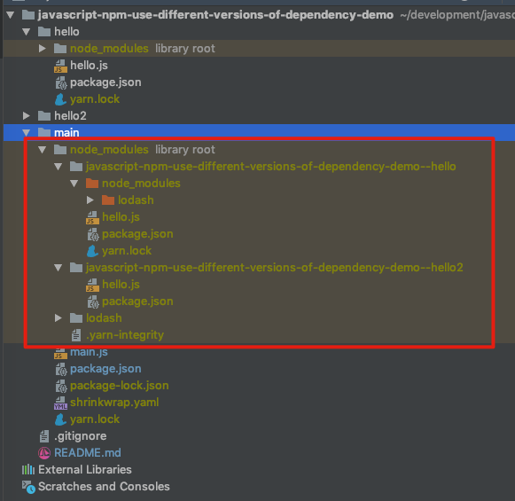

JavaScript Npm Use Different Versions of Dependency Demo
========================================================

如果一个项目使用的某个package在它引用的某个dependency中也用到了，但是两者使用的版本不同，
最后将会使用哪个版本呢？

通过这个Demo可以发现，有多种情况：
1. 如果两处要求的版本是兼容的（比如`4.17.11`和`^4.0.1`），则会使用同时满足两者的的版本
2. 如果不兼容，比如(`4.17.11`和`3.10.1`），则各自使用各自版本

运行`npm list`:

```
$ npm list
javascript-npm-use-different-versions-of-dependency-demo/main
├─┬ javascript-npm-use-different-versions-of-dependency-demo--hello@0.1.0
│ └── lodash@3.10.1
├─┬ javascript-npm-use-different-versions-of-dependency-demo--hello2@0.1.0
│ └── lodash@4.17.11 deduped
└── lodash@4.17.11
```

在`main`项目下的`node_modules`可以看出：



```
npm install
npm list
```

Shows dependency list:

```
/Users/peng.li/development/javascript-npm-use-different-versions-of-dependency-demo/main
├─┬ javascript-npm-use-different-versions-of-dependency-demo--hello@0.1.0
│ └── lodash@3.10.1
└── lodash@4.17.11
```
